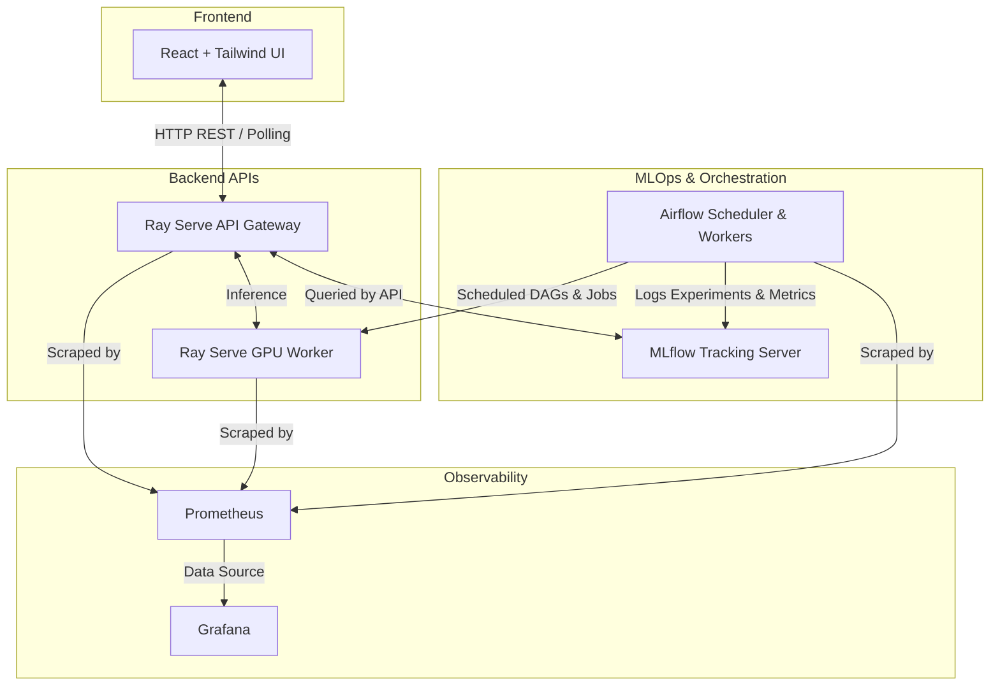

# MLOps 3D Scene Reconstruction

## Overview
This project focuses on **Image Matching and 3D Reconstruction** using advanced feature mapping and global descriptors powered by pre-trained foundation models like **MASt3R** and **DUSt3r**. 

Given a set of multi-view images of a scene, the application recovers the 3D structure by estimating each camera’s rotation matrix (R) and translation vector (t) with high accuracy. This core computer vision capability enables down-stream applications in:
* AR/VR
* Robotics and Autonomous Driving
* Cultural Heritage Digitization
* Surveying and Topography

## Architecture



The system consists of two distinct layers: an **offline MLOps pipeline** and an **online inference pipeline**.

In the **offline layer**, Airflow orchestrates the execution of the pipeline, while DVC defines the pipeline stages and ensures reproducibility. Different configurations are experimented with using DVC, and each run logs parameters, metrics, and artifacts to MLflow using a local PostgreSQL backend. The best-performing configuration is selected based on evaluation metrics and is associated with a specific Git commit and MLflow run. This combination of code version and configuration is promoted to production.

In the **production layer**, Ray Serve and FastAPI serve the application. When a user uploads a zip file of images, the same pipeline logic is executed directly (without DVC), using the selected configuration. The pipeline performs preprocessing, feature extraction, matching, and 3D reconstruction using COLMAP, producing a `.ply` file which is then visualized in the UI. This separation ensures reproducibility during development and efficiency during inference.

## Pre-trained Models

We have already included the necessary pre-trained models as Git LFS objects in the `extra/pretrained_models` directory. However, if you need to download them manually, you can use the links below:

### ALIKED
* [aliked-n16.pth](https://github.com/Shiaoming/ALIKED/raw/main/models/aliked-n16.pth)

### ISC
* [isc_ft_v107.pth.tar](https://github.com/lyakaap/ISC21-Descriptor-Track-1st/releases/download/v1.0.1/isc_ft_v107.pth.tar)

### MASt3R
* [MASt3R_ViTLarge_BaseDecoder_512_catmlpdpt_metric_retrieval_trainingfree.pth](https://download.europe.naverlabs.com/ComputerVision/MASt3R/MASt3R_ViTLarge_BaseDecoder_512_catmlpdpt_metric_retrieval_trainingfree.pth)
* [MASt3R_ViTLarge_BaseDecoder_512_catmlpdpt_metric_retrieval_codebook.pkl](https://download.europe.naverlabs.com/ComputerVision/MASt3R/MASt3R_ViTLarge_BaseDecoder_512_catmlpdpt_metric_retrieval_codebook.pkl)
* [MASt3R_ViTLarge_BaseDecoder_512_catmlpdpt_metric.pth](https://download.europe.naverlabs.com/ComputerVision/MASt3R/MASt3R_ViTLarge_BaseDecoder_512_catmlpdpt_metric.pth)

## Installation & Setup

### Docker Mode (Recommended)

1. **Configure `.env` file**: Ensure you have `.env` set up in the project root.
   ```bash
   export HOST_PROJECT_ROOT=$(pwd)
   export AIRFLOW_UID=$(id -u)
   FERNET_KEY=LS47uw30w1OWKkHCGlSjEKkE3FQ2_ynycWQJ-Sd-y30=
   ```

2. **Generate Docker Secrets**: We use Docker Secrets for managing sensitive data. Run the setup script:
   ```bash
   bash scripts/generate_secrets.sh
   ```

3. **Start the Stack**:
   ```bash
   docker compose --profile inference up --build -d
   ```

### Developer Mode (Native)

If you wish to run the project natively for development, follow these steps:

**1. Build ASMK:**
```bash
git clone https://github.com/jenicek/asmk
cd asmk/cython/
cythonize *.pyx
cd ..
python -m build --no-isolation
cd ..
```

**2. Build CroCo / DUSt3r Kernels:**
DUST3R relies on RoPE positional embeddings, requiring compiled CUDA kernels for faster runtime.
```bash
git clone https://github.com/naver/croco.git
cd croco/models/curope/
python -m build --no-isolation
cd ../../
```

**3. Build Packages and Move to Bundle:**
Build the packages as `*.whl` files by running `python -m build --no-isolation` in their respective directories, and move the compiled `.whl` files to `bundle/oss`.

**4. Set up Python Environment:**
Install `uv` and create a virtual environment:
```bash
# Install dependencies
uv venv
source .venv/bin/activate
uv pip install -e .

# Set library path for PyTorch
export LD_LIBRARY_PATH=.venv/lib/python3.11/site-packages/torch/lib:$LD_LIBRARY_PATH

# Source the python venv
source .venv/bin/activate
```

## Running the Project Locally

### 1. DVC / MLflow Offline Pipeline
To run the DVC reproduction graph and track experiments in MLflow:
```bash
PARENT_ID=$(python scripts/start_parent_dvc_run.py | head -n 1)
MLFLOW_PARENT_RUN_ID="$PARENT_ID" dvc repro
python scripts/select_best_run.py
```

### 2. Launching the UI & Backend
Open two separate terminals to run the frontend and backend locally:

**Backend (Terminal 1)**
```bash
cd MLOps-Project-ME22B214/api
ray start --head --dashboard-host=0.0.0.0 && serve run serve_app:api_node
```

**Frontend (Terminal 2)**
```bash
cd frontend && npm run dev
# → http://localhost:5173
```

Alternatively, to run the UI & API purely via Docker Compose:
```bash
docker compose --profile inference up --build
# → Frontend: http://localhost:5173
# → API:      http://localhost:8000
```

## API Endpoints

The API Gateway exposes the following key endpoints. *Note: Most endpoints are protected by JWT Bearer Authentication.*

| Endpoint | Method | Auth Required | Description |
|---|---|---|---|
| `/auth/token` | POST | No | Login with username/password to receive a JWT access token. |
| `/upload` | POST | Yes | Upload a zip archive of images to start the 3D reconstruction pipeline. |
| `/drift` | POST | Yes | Analyze a zip archive for data drift and calculate image statistics. |
| `/jobs/{job_id}` | GET | Yes | Check the status and progress of a specific reconstruction job. |
| `/jobs/{job_id}/insights` | GET | Yes | View consolidated drift reports and reconstruction insights for a job. |
| `/clusters/{job_id}` | GET | Yes | Fetch specific point cloud cluster information and metadata for a job. |
| `/download/jobs/{job_id}` | GET | Yes | Download the final generated `.ply` point cloud archives. |
| `/download/jobs/{job_id}/csv` | GET | Yes | Download the raw Kaggle-formatted submission CSV. |
| `/drift/trigger-retrain` | POST | Yes | Manually trigger the Airflow retraining DAG if drift is critical. |
| `/health` | GET | No | Basic API and worker healthcheck endpoint. |
| `/ready` | GET | No | Readiness probe for deployment orchestration. |
| `/metrics` | GET | No | Prometheus metrics scraping endpoint. |

## Testing Drift Detection
To test the data drift detection pipeline directly, run the `detect_drift.py` script:

```bash
python scripts/detect_drift.py
```

You can point the script to a custom dataset using the `DATA_DIR` environment variable:
```bash
DATA_DIR=/path/to/custom/dataset python scripts/detect_drift.py
```