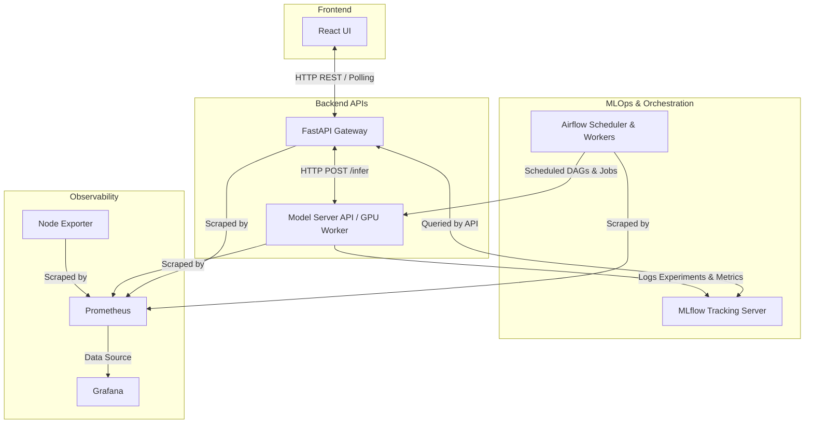

Data: kagglehub.competition_download('image-matching-challenge-2025')
# Install Python-3.11 if needed.
$ uv python install 3.11

# Use Python-3.11, aligning with the Python version in the Kaggle notebook.
$ uv python pin 3.11
$ python --version
Python 3.11.11

# Install dependencies with pyproject.toml.
# Actually, this command will fail because pre-built ASMK and curope packages is not in bundle/oss
$ uv sync
$ . .venv/bin/activate

Or use docker-compose.yaml to run the project.
Configure .env
AIRFLOW_UID=1000
FERNET_KEY=LS47uw30w1OWKkHCGlSjEKkE3FQ2_ynycWQJ-Sd-y30=
_AIRFLOW_WWW_USER_USERNAME=airflow
_AIRFLOW_WWW_USER_PASSWORD=airflow
AIRFLOW__API_AUTH__JWT_SECRET=somekey

Put models in extra/pretrainned_models:
ALIKED:
wget https://github.com/Shiaoming/ALIKED/raw/main/models/aliked-n16.pth
ISC:
wget https://github.com/lyakaap/ISC21-Descriptor-Track-1st/releases/download/v1.0.1/isc_ft_v107.pth.tar
MASt3R:
wget https://download.europe.naverlabs.com/ComputerVision/MASt3R/MASt3R_ViTLarge_BaseDecoder_512_catmlpdpt_metric_retrieval_trainingfree.pth
wget https://download.europe.naverlabs.com/ComputerVision/MASt3R/MASt3R_ViTLarge_BaseDecoder_512_catmlpdpt_metric_retrieval_codebook.pkl
wget https://download.europe.naverlabs.com/ComputerVision/MASt3R/MASt3R_ViTLarge_BaseDecoder_512_catmlpdpt_metric.pth


git clone https://github.com/jenicek/asmk
cd asmk/cython/
cythonize *.pyx
cd ..
python3 setup.py build_ext --inplace
cd ..

# DUST3R relies on RoPE positional embeddings for which you can compile some cuda kernels for faster runtime.
git clone https://github.com/naver/croco.git
cd croco/models/curope/
python setup.py build_ext --inplace
cd ../../

Build the packages as *.whl file and move them into bundle/oss before uv sync.
python -m build --no-isolation

export LD_LIBRARY_PATH=.venv/lib/python3.11/site-packages/torch/lib:$LD_LIBRARY_PATH

```
./venv/bin/python3 scripts/train_experiment.py \ 
        --config conf/mast3r.yaml \ 
        --datasets ETs stairs \ 
        --experiment-name scene_reconstruction
```

UI
# Backend (terminal 1)
cd /home/abhiyaan-cu/Yash/MLOps-Project-ME22B214
.venv/bin/uvicorn api.scene3d_server:app --reload --port 8002

# Frontend (terminal 2)
cd frontend && npm run dev
# → http://localhost:5173


docker compose -f docker-compose.scene3d.yaml up --build
# → Frontend: http://localhost:5173
# → API:      http://localhost:8002

## Architecture



### Block Explanations
* **Frontend (React UI)**: Handles user interaction, image point cloud viewing, and polls the FastAPI Gateway for job completion.
* **FastAPI Gateway**: The primary API ingress for the application. It receives requests, controls job queuing natively over HTTP, and delegates GPU workloads to the model server.
* **Model Server API & GPU Worker**: A dedicated process loaded precisely to handle memory-intensive PyTorch GPU inference pipelines like MASt3R, preventing global execution locks on the main gateway.
* **MLflow Tracking Server**: Keeps a historical record of all runs, metrics like registration rates, and final artifacts natively linked to the orchestration platform.
* **Airflow Components**: Manages scheduled execution environments such as data ingestion pipelines, triggered model retraining, and scheduled drift checking reports.
* **Observability Stack**: Prometheus aggregates operational metrics (latency, HTTP logs) alongside system components (Node Exporter). Grafana connects to Prometheus to visualize system health, model drift, and memory usage metrics.


So for production promotion workflow:

Promote best run in MLflow Registry (already implemented in training/DAG flow).
Update deployed config/weights to match that promoted run.
Restart model-server + api.
I want to do this